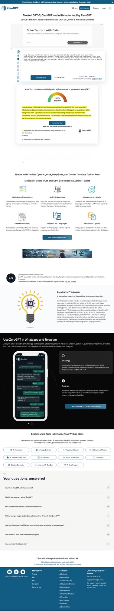
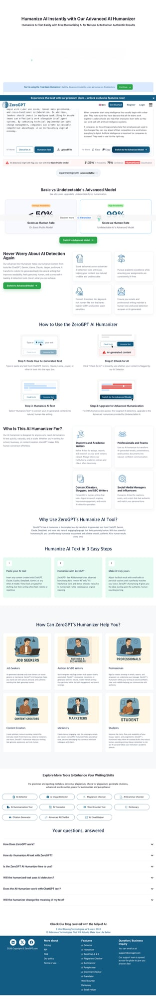

## Why I ran this experiment

When you read posts about **humanize AI text** tools, many claim they can almost perfectly bypass AI detection. Before trying one myself, I was skeptical and wanted measurable numbers.

In this post, I tested three samples in the same ZeroGPT flow and logged how scores changed before and after applying Humanizer. I did not start with a fixed conclusion—I focused on observed results.

## Test setup

- Tool: ZeroGPT
- Flow: detect original text → apply Humanizer → re-detect in the same interface
- Reading metric: A score and C score shown on screen
- Sample count: 3

I could not fully control sentence length, topic, or model type during the test. So this is less of a strict benchmark and more of a practical field note from a real usage scenario.

## Summary of results

| Sample | Before | After |
| --- | --- | --- |
| Sample 1 | A 100/50 | C 0/100 |
| Sample 2 | A 100/0 | C 0/100 |
| Sample 3 | A 100/0 | C 21.23/75 |

At a glance, Samples 1 and 2 showed a strong drop in detection signal, while Sample 3 retained partial signal. The key takeaway is variance: even with the same tool, outcomes differ by sample characteristics.

## Sample 1 details

_Caption: Sample 1 started at A 100/50 and was displayed as C 0/100 after Humanizer._

The first sample had a high score before conversion, then showed no visible AI signal after Humanizer. Looking only at this case, the marketing claims do not feel entirely exaggerated.

## Sample 2 details

_Caption: Sample 2 also changed from A 100/0 to C 0/100._

The second sample followed a similar pattern. The change was large and clear, suggesting that for certain sentence types, Humanizer can strongly affect detection scores.

## Sample 3 details

_Caption: Sample 3 dropped from A 100/0 to C 21.23/75, but the signal did not disappear completely._

Unlike the first two cases, residual score remained in the third sample. This is why I do not see humanize-AI-text tools as universal bypass methods. Factors like sentence structure, vocabulary distribution, and context consistency can still leave detectable traces.

## My conclusion

The conclusion from these three runs is simple: score improvement was real, but complete evasion was not guaranteed for every sample. In practice, one-pass conversion is not enough—you should re-check outputs and manually refine context and tone.

To me, final human editing matters most. If you optimize only for lower detection scores, you can lose information density or drift away from the intended voice. Natural and accurate writing for readers comes first; detector scores should be a secondary validation metric.

## Closing

This is not a promotional comparison piece for the **humanize AI text** keyword. It is a screenshot-and-metrics-based experiment log.

Next, I plan to increase sample size and repeat tests under fixed topic and length constraints to better isolate where the variance comes from.

Even with the same tool, outcomes can differ. Build a verification routine that matches your own use case first.
