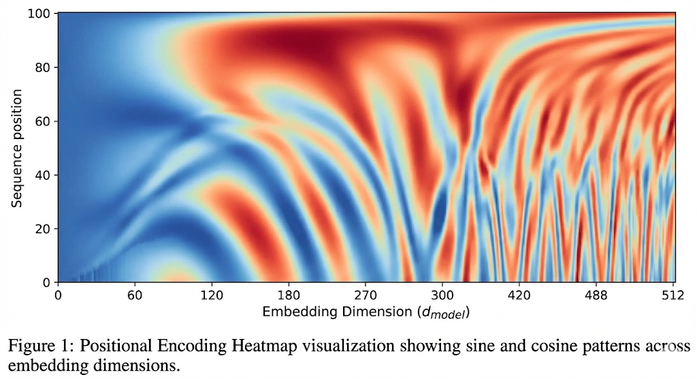

# 1. 서론: 자연어 처리의 패러다임을 바꾼 거인, 트랜스포머

현대 생성형 인공지능의 근간인 트랜스포머(Transformer)는 "어텐션만 있으면 충분하다(Attention Is All You Need)"는 선언으로 기존 순환 구조(RNN)의 한계를 극복하고 현대 LLM의 표준이 되었다.

병렬 연산(Parallel Computing)의 혁신과 문장 속 단어들 사이의 관계를 입체적으로 연결하여 텍스트의 숨은 의미와 맥락을 짚어내는 셀프 어텐션(Self-Attention)은 과연 어떻게 거대한 데이터를 지능으로 전환시키는 것일까?

RNN은 단어를 하나씩 순서대로 처리해야 하기에 GPU의 병렬성을 활용하지 못했고, 문장이 길어질수록 앞단의 정보가 소실되는 치명적인 단점이 있었다. 구글은 순환(Recurrence)을 완전히 제거하고, 오직 어텐션만으로 시퀀스를 처리하는 아키텍처를 통해 이 문제를 해결했다.

데이터가 트랜스포머라는 거대한 파이프라인을 통과하며 어떻게 의미를 갖게 되는지, 그 구조적 흐름을 딥다이브 해본다.

# 2. 배경: 왜 RNN은 물러나야 했는가.

트랜스포머 이전의 자연어 처리는 RNN기반의 Seq2Seq 모델이 주도했다. 하지만 두가지 치명적인 문제가 있었다.

1. 순차적 연산의 한계: RNN은 단어를 하나씩 순서대로 처리해야 한다. 이는 현대 GPU의 강점인 병렬 연산(Parallelism)을 활용하지 못하게 하여 대규모 학습을 방해했다.
2. 정보 소실 및 장기 의존성 문제: 문장이 길어질수록 앞부분의 정보가 뒤로 전달되지 못하고 희미해지는 현상이 발생했다.

구글은 “Attention Is All You Need”라는 도발적인 제목의 논문을 통해, 순환 구조를 완전히 제거하고 오직 어텐션(Attention)만으로 시퀀스 데이터를 처리하는 트랜스포머를 내놓았다.

# 3. 데이터 준비(Data Preparation)

모델이 연산을 시작하기 전, 인간의 언어를 기계가 이해할 수 있는 수학적 형태로 변환하는 단계다.

## 3.1 입력 임베딩 (Input Embedding)

입력된 문장의 각 단어를 고차원의 벡터 공간으로 변환한다. 이를 통해 단어의 의미적 유사성을 수치화한다.

## 3.2 포지셔널 인코딩 (Positional Encoding)

트랜스포머는 순환 구조가 없기 때문에 단어의 순서 정보를 알 수 없다. 따라서 단어 임베딩 벡터에 위치 정보를 담은 벡터를 더해준다.

- 주기가 서로 다른 사인(Sine), 코사인(Cosine) 함수를 사용하여 각 위치마다 고유한 패턴을 부여한다.
- 이를 통해 모델은 단어의 상대적인 위치 관계를 학습한다.

# **4. 인코더 (Encoder): 문맥의 이해와 추상화**

준비된 데이터는 먼저 인코더 스택을 통과한다. 인코더의 목적은 입력 시퀀스를 온전히 '이해'하여 문맥 정보가 함축된 벡터로 압축하는 것이다.

$N$개의 동일한 레이어가 반복되며, 각 레이어는 두 개의 서브 레이어로 구성된다.

## **4.1 멀티-헤드 셀프 어텐션 (Multi-Head Self-Attention)**

문장 내 각 단어가 다른 단어들과 어떤 연관성이 있는지 계산한다. (예: "그는 사과를 먹었다"에서 "그는"과 "먹었다"의 관계 파악)

- **입력/출력**: 입력 벡터 $X$로부터 $Q, K, V$를 모두 생성하여(Self), 문맥이 반영된 벡터 $Z$를 출력한다.
- **멀티-헤드(Multi-Head)** : 모델의 차원($d_{model}$)을 헤드 수($h$)로 나누어 병렬로 처리한다. 이를 통해 문법적 관계, 의미적 연관성 등 서로 다른 특징을 독립적인 공간에서 입체적으로 학습한다.

## **4.2 포지션-와이즈 피드 포워드 (Position-wise Feed-Forward Networks)**

어텐션으로 추출된 특징을 정제하고 강화한다.

- **프로세스**: 벡터 차원을 일시적으로 4배 확장($d_{ff}$)한 뒤 비선형 활성화 함수(ReLU)를 거쳐 다시 원래 차원으로 압축한다.
- **의의**: 단순한 단어의 조합을 넘어 추상적인 맥락 정보를 학습하는 단계다.

## **4.3 안정성을 위한 인프라: Add & Norm**

모든 서브 레이어 뒤에는 **잔차 연결(Residual Connection)** 과 **층 정규화(Layer Normalization)** 가 뒤따른다.

- **Add**: $x + \text{Sublayer}(x)$ 형태로 원본 정보를 보존하여 깊은 층에서도 학습이 잘 되도록 돕는다.
- **Norm**: 데이터의 분포를 평균 0, 분산 1로 조정하여 학습 속도와 안정성을 확보한다.**인코더의 최종 출력**: 인코더의 마지막 레이어를 통과한 **키(Key)** 와 **값(Value)** 행렬은 입력 문장의 모든 정보를 담고 있으며, 이는 디코더의 모든 레이어로 복사되어 전달된다.

# 5. 디코더(Decoder): 생성의 미학

디코더는 인코더가 넘겨준 정보($K, V$)와 자신이 지금까지 생성한 정보($Q$)를 결합하여 다음 단어를 예측한다.

## **5.1 마스크드 멀티-헤드 어텐션 (Masked Multi-Head Attention)**

디코더의 첫 번째 관문이다. 자신의 이전 출력들을 입력으로 받는다.

**Masking**: 학습 시에는 정답을 다 알고 있지만, 추론 시에는 미래의 단어를 볼 수 없다. 이를 시뮬레이션하기 위해 자기 자신보다 뒤에 있는 단어에는 $-\infty$ 마스킹을 씌워 어텐션 점수를 0으로 만든다. 이는 자기회귀(Autoregressive) 속성을 유지하는 핵심 장치다.

## **5.2 인코더-디코더 어텐션 (Encoder-Decoder Attention)**

트랜스포머의 가장 중요한 연결 고리다. 번역이나 생성을 할 때 원문의 어떤 부분을 참고할지 결정한다.

- **쿼리(Query)**: 디코더 레이어에서 올라온 '현재 생성 중인 단어'의 정보.
- **키(Key) & 값(Value)**: 인코더의 최종 출력에서 제공받은 '입력 문장 전체'의 정보.
- **동작**: 디코더는 이 과정을 통해 매 단계마다 입력 문장의 맥락을 다시 확인하며(Cross-Reference) 출력 단어를 결정한다.

## **5.3 피드 포워드 및 Add & Norm**

인코더와 마찬가지로 어텐션 결과를 비선형 변환으로 강화하고, 잔차 연결과 정규화를 수행하여 다음 레이어로 넘긴다.

# **6. 핵심 엔진: 스케일드 점곱 어텐션 (Scaled Dot-Product Attention)**

위의 모든 어텐션 메커니즘 내부에서 실제로 돌아가는 수학적 연산 엔진이다.

$$
\text{Attention}(Q, K, V) = \text{softmax}\left(\frac{QK^T}{\sqrt{d_k}}\right)V
$$

- **MatMul ($QK^T$)**: 쿼리와 키의 내적을 통해 유사도를 구한다.
- **Scale ( $\frac{1}{\sqrt{d_k}}$ )**: 차원이 커질수록 값이 발산하여 소프트맥스 기울기가 소실되는 것을 막기 위해 보정한다.
- **Mask (Optional)**: 디코더의 첫 번째 레이어에서 미래 정보를 가릴 때 사용한다.
- **Softmax**: 유사도 점수를 확률값(가중치)으로 변환한다.
- **MatMul (With $V$)**: 가중치를 값(Value) 벡터에 곱해 최종 문맥 벡터(가중합)를 생성한다.

# **7. 동작 흐름: 학습과 추론의 파이프라인**

트랜스포머의 동작 방식은 학습(Training)과 추론(Inference) 단계에서 결정적인 차이를 보인다.

## **7.1 학습 시 (Parallelism)**

정답 문장(Target) 전체를 알고 있으므로, 디코더에도 문장 전체를 한 번에 입력한다(Teacher Forcing). 마스크드 어텐션 덕분에 각 위치는 자신의 이전 위치까지만 볼 수 있으므로, **모든 단어의 예측을 병렬로 동시에 수행**할 수 있다.

## **7.2 추론 시 (Autoregressive Loop)**

실제 서비스 단계에서는 다음과 같은 **자기회귀 루프**를 통해 단어를 하나씩 생성한다.

1. **초기화**: 시작 토큰 `<SOS>`를 디코더에 입력한다.
2. **디코딩**:
   - 인코더에서 받은 $K, V$(원문 정보)는 고정된 상태로 디코더의 모든 레이어에서 참조된다.
   - 디코더 스택을 통과한 최종 벡터는 **Linear** 층을 거쳐 단어 사전 크기만큼 확장된다.
   - **Softmax**를 통해 각 단어의 등장 확률을 계산한다.
3. **결과 선택 (Argmax)** : 가장 높은 확률을 가진 단어를 이번 단계의 출력으로 선택한다.
4. **피드백 루프 (Feedback Loop)** :
   - 선택된 단어는 다시 디코더의 입력 시퀀스 끝에 추가된다.
   - 갱신된 입력을 바탕으로 다음 단어를 예측한다.
5. **종료**: 종료 토큰 `<EOS>`가 나오거나 최대 길이에 도달하면 루프를 멈춘다.

# **8. 마치며**

"Attention Is All You Need"라는 도발적인 제목으로 등장한 트랜스포머는, 이제 자연어 처리를 넘어 컴퓨터 비전(Computer Vision), 시계열 분석, 심지어 로보틱스에 이르기까지 현대 AI의 **파운데이션 모델(Foundation Models)** 을 지탱하는 거대한 표준이 되었다.

처음 해본 논문 리뷰지만 꽤 재밌게 볼 수 있었다. 백엔드 개발자의 관점에서 트랜스포머를 분석하며 느낀점은, 인공지능 역시 결국 정교하게 설계된 **데이터 파이프라인(Data Pipeline)** 의 집합체라는 점이다. RNN이 가졌던 순차적 제약을 깨고 병렬 처리를 극대화한 이 아키텍처는, 엔지니어링적 관점에서 '확장성'과 '효율성'을 어떻게 동시에 잡을 수 있는지를 보여주는 완벽한 사례라고 생각한다.

처음 수식을 접했을 때는 막연한 두려움이 앞섰지만, $Q, K, V$라는 인터페이스를 통해 데이터가 흐르고 결합되는 과정을 추적하다 보니 복잡한 매커니즘 뒤에 숨겨진 수학적 아름다움을 발견할 수 있었다. 단순히 '마법 같은 알고리즘'이 아니라, 명확한 설계 철학 위에서 구현된 시스템임을 깨닫는 과정이었다.

AI 엔지니어로 전향하는 과정에서 이 논문은 단순한 지식을 넘어, 새로운 기술적 한계를 돌파하는 엔지니어링적 사고방식을 가르쳐준 이정표가 되었다.
