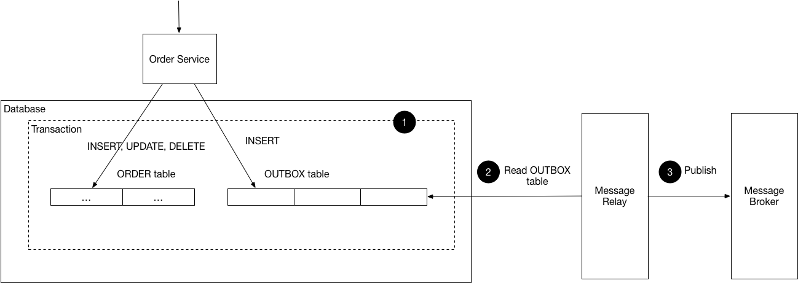

## Transactional Outbox 소개

트랜잭셔널 아웃박스(Transactional Outbox)는 분산 시스템에서 데이터베이스 업데이트와 메시지 발행(Publishing) 사이의 원자성(Atomicity)을 보장하기 위한 핵심적인 설계 패턴이다.

## Transactional Outbox는 왜 필요한가

일반적으로 마이크로서비스 환경에서는 자신의 DB를 업데이트한 후 다른 서비스에 알리기 위해 이벤트를 발행한다. 이때 다음과 같은 장애 시나리오가 발생한다.

- 시나리오 A: DB 업데이트 성공 후 Kafka 전송 시도 중 네트워크 오류로 메시지 유실 → 다른 서비스는 변경 사실을 모름
- 시나리오 B: 메시지 전송은 성공했으나, DB 커밋 직전 서버 다운으로 트랜잭션 롤백 → 다른 서비스는 존재하지 않는 데이터를 처리하게 됨

이처럼 두 개의 서로 다른 시스템을 하나의 트랜잭션으로 묶는 것은 분산 트랜잭션 없이는 불가능하며, 성능 저하의 주범이 된다.

## Transactional Outbox의 구조와 작동 원리

이 패턴은 DB의 트랜잭션의 원자성은 100% 믿을 수 있다는 점을 이용한다.

Order서비스에 주문이 들어오고 이 변경사항을 다른 MSA에게 알려줘야한다고 가정해보자.



1. 로컬 트랜잭션 시작: 애플리케이션에서 DB 트랜잭션을 시작한다.
2. 비즈니스 데이터 저장: orders 테이블에 주문 정보를 저장한다.
3. 메시지 기록(Outbox): 동일한 트랜잭션 내에서 outbox라는 전용 테이블에 보낼 이벤트 메시지를 INSERT한다.
4. 트랜잭션 커밋: 이 과정에서 Outbox에 저장이 실패하면 DBMS의 원자성(Atomicity) 덕분에 전체 트랜잭션이 롤백되기 때문에 데이터 정합성이 완벽하게 유지된다.
5. 메시지 발행(Message Relay): 별도의 독립된 프로세스가 outbox 테이블을 감시하며 새로 들어온 메시지를 읽어 메시지 브로커로 전송한다.
6. 완료 처리: 전송이 성공하면 outbox 테이블의 해당 레코드를 삭제하거나 완료 상태로 변경한다.

## 아웃박스 테이블의 데이터를 읽는 전략

메시지를 브로커로 전달하는 릴레이 프로세스는 크게 두가지 전략으로 구현한다.

1. 폴링 퍼블리셔(Polling Publisher)
   - 방식: 릴레이 서비스가 주기적으로 outbox 테이블을 읽어서 미전송 데이터를 찾는다.
   - 장점: 구현이 매우 단순한다.
   - 단점: DB에 지속적인 쿼리 부하를 주고, 실시간성이 다소 떨어질 수 있다.
2. CDC(Change Data Capture)
   - 방식: DB의 트랜잭션 로그를 직접 읽어서 변경 사항을 감지한다.
   - 도구: Debezium, Kafka Connect
   - 장점: DB에 직접 쿼리를 날리지 않아 부하가 거의 없고 매우 빠른 실시간 전송이 가능
   - 단점: 인프라 설정이 상대적으로 복잡하다.

## 패턴 도입시 얻게되는 이점

- 데이터 일관성 보장: 이벤트 유실이나 잘못된 이벤트 발행이 발생하지 않는다.
- Decoupling: 애플리케이션 로직은 메시지 브로커의 상태에 신경 쓰지 않고 자신의 DB 작업만 완료하면 된다.
- 신뢰성 있는 재시도: 메시지 브로커가 잠시 죽더라도 outbox 테이블에 데이터가 남아있으므로, 브로커가 복구되면 릴레이 프로세스가 다시 전송을 시작한다.

## 주의사항 및 한계

- 메시지 중복 발행: 릴레이 프로세스가 메시지를 보낸 직후 완료 처리를 하기 전에 죽는다면, 다시 살아나서 같은 메시지를 또 보낼 수 있다. 따라서 멱등성 보장이 필수적이다.
- 테이블 관리: 완료된 메시지를 주기적으로 삭제해주지 않으면 outbox 테이블이 비대해져 성능에 악영향을 줄 수 있다.

## [실습] Transactional Outbox를 구현해보기

nest.js를 베이스로 Transactional Outbox를 간단히 구현해보겠다.

kafka와 postgre는 docker compose를 이용해 간단히 띄워볼 예정이다.

### 1. 기술스택

- Nest.js
- Kafka (docker container 사용)
- PostgreSQL
- Prisma

### 2. 데이터 모델

데이터 모델은 다음과 같이 간단하게 구성했다.

```yaml
datasource db {
provider = "postgresql"
url      = env("DATABASE_URL")
}

generator client {
provider = "prisma-client-js"
}

// 주문 모델
model Order {
id        Int      @id @default(autoincrement())
orderNo   String   @unique
orderDate DateTime @default(now())
productId String
createdAt DateTime @default(now())
}

// Outbox 모델 (발행용)
model Outbox {
id          String   @id @default(uuid())
eventType   String
payload     Json
processedAt DateTime? // 전송 완료 시 기록
createdAt   DateTime @default(now())
}

// Inbox 모델 (수신용 - 멱등성 보장)
model Inbox {
id          String   @id // Kafka 메시지 ID 저장
processedAt DateTime @default(now())
}
```

### 3. **Write path: 주문 생성 시 Order + Outbox를 한 번에 커밋한다**

API가 주문 생성 요청을 받으면, 서비스에서 아래 흐름으로 처리한다.

- 주문을 저장한다.
- 동일 트랜잭션에서 outbox에 ORDER_CREATED 이벤트를 저장한다.
- 트랜잭션이 커밋되면, **주문 데이터와 발행할 이벤트**가 항상 같이 존재하게 된다.

```ts
async createOrder(productId: string) {
    const orderNo = `ORD-${Date.now()}`;

    return await this.prisma.$transaction(async (tx) => {
      // 1. 주문 저장
      const order = await tx.order.create({
        data: { orderNo, productId },
      });

      // 2. 아웃박스에 이벤트 저장 (메시지 ID를 생성하여 넣음)
      await tx.outbox.create({
        data: {
          eventType: 'ORDER_CREATED',
          payload: { orderNo: order.orderNo, productId: order.productId },
        },
      });

      return order;
    });
  }
```

여기서 중요한 건 Kafka 발행을 이 트랜잭션에 **억지로 끼워 넣지 않는다**는 점이다.

외부 브로커는 DB 트랜잭션에 묶기 어렵고, 묶더라도 운영 복잡성이 올라간다. 대신 **Outbox에 기록만 남기고**, 발행은 다음 단계에서 처리한다.

### **4. Relay: Outbox Processor가 미처리 이벤트를 찾아 Kafka로 발행한다**

이제 Outbox에 쌓인 이벤트는 누가 발행할까? 이 역할을 하는 것이 Outbox Processor다.

- 주기적으로 processedAt = null 레코드를 조회한다.
- Kafka로 order.created 토픽(이벤트)을 발행한다.
- 발행 성공 시 processedAt을 업데이트한다.

```ts
@Cron(CronExpression.EVERY_5_SECONDS)
  async processOutbox() {
    const messages = await this.prisma.outbox.findMany({
      where: { processedAt: null },
      take: 10,
    });

    // 메시지가 있을 때만 로그 출력
    if (messages.length > 0) {
      this.logger.log(
        `Found ${messages.length} unprocessed messages. Publishing...`,
      );

      for (const message of messages) {
        try {
          const payload = message.payload as unknown as Omit<
            OrderCreatedEvent,
            'id'
          >;
          const event: OrderCreatedEvent = {
            id: message.id,
            orderNo: payload.orderNo,
            productId: payload.productId,
          };
          // Kafka 발행
          this.kafkaClient.emit('order.created', event);

          // DB 업데이트
          await this.prisma.outbox.update({
            where: { id: message.id },
            data: { processedAt: new Date() },
          });

          this.logger.log(`Message (ID: ${message.id}) published to Kafka.`);
        } catch (e) {
          this.logger.error(`Failed to publish message: ${e.message}`);
        }
      }
    }
  }
```

이 구조는 즉시 발행을 포기하는 대신 **신뢰성**을 얻는다.

- 주문 트랜잭션이 커밋되면, 이벤트는 Outbox에 남아있다.
- 프로세서가 죽어도, 다시 살아나면 미처리 이벤트를 재발행한다.

### 5. **Read path: Consumer는 Inbox로 멱등성을 확보한다(중복 처리 방지)**

Kafka는 상황에 따라 중복 전달이 발생할 수 있고(혹은 컨슈머 재시도), 프로듀서/네트워크 장애 상황에서도 **적어도 한 번(at-least-once)** 전달을 기준으로 설계하는 경우가 많다.

따라서 컨슈머는 **중복 메시지를 받아도 안전**해야 한다.

이 글의 컨슈머는 아래 방식을 사용한다.

- 메시지의 id를 Inbox에 먼저 저장한다(키는 id).
- 저장이 성공하면 처리된 적 없는 메시지이므로 비즈니스 로직을 진행한다.
- 저장이 실패하면(중복) 이미 처리된 메시지이므로 조용히 종료한다.

```ts
@MessagePattern('order.created')
  async handleOrderCreated(@Payload() data: OrderCreatedEvent): Promise<void> {
    const messageId: string = data.id;
    const orderNo: string = data.orderNo;

    this.logger.log(`Received message: ${messageId}`);

    // 1. Inbox 확인 및 저장 (트랜잭션)
    try {
      await this.prisma.inbox.create({
        data: { id: messageId },
      });

      this.logger.log(`Inbox saved. Processing Order: ${orderNo}`);
    } catch (e) {
      this.logger.warn(
        `Duplicate message detected (Idempotency check): ${messageId}`,
      );
      return;
    }

    // 2. 실제 비즈니스 로직 수행 (예: 재고 차감 등)
    this.logger.log(`Processing Order: ${orderNo}`);
  }
```

## 마치며

이번 시간엔 Transactional Outbox 패턴에 대해 알아보았다. DB의 원자성을 활용한 Outbox 패턴은 분산 트랜잭션 없이도 시스템 간 정합성을 유지할 수 있는 가장 우아한 방법 중 하나라고 생각한다. 이번 시간에는 폴링 방식을 다루었지만, 더 높은 처리량이 필요한 환경이라면 CDC(Debezium) 도입을 고려해 보는 것도 좋다.

자세한 구현 코드는 다음 Github Repository에서 확인할 수 있다.

[https://github.com/suites/transactional-outbox](https://github.com/suites/transactional-outbox)

## Appendix

[https://microservices.io/patterns/data/transactional-outbox.html](https://microservices.io/patterns/data/transactional-outbox.html)
